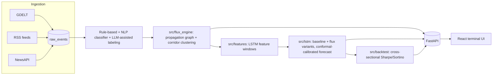

# Flux

**Real-time geopolitical & economic event intelligence for equity markets.**

Flux watches the world so you don't have to. It ingests live news and
structured-event data around the clock, scores each event's market relevance
through a custom propagation-graph model, and forecasts price impact across a
23-ticker, 4-sector universe with calibrated uncertainty — all surfaced
through a terminal-style live dashboard built for fast, at-a-glance reads.

[](LICENSE)

---

## Overview

Every tracked stock sits downstream of a real-world event graph: a Saudi
export policy, a Taiwan trade dispute, an FDA ruling. Most of that signal
never makes it into a price chart until it's already priced in. Flux ingests
the event stream continuously, classifies and clusters it, and propagates
each event's estimated impact through a country → sector → stock exposure
graph to produce a per-ticker **flux score** — a single, explainable number
summarizing how much event-driven pressure a stock is under on a given day,
and *why*.

From there, Flux turns that signal into something usable: a 30-day price
forecast with an honestly-calibrated uncertainty band, a 3D causality graph
you can actually interrogate, and a systematic backtesting harness that holds
every claim to the same bar a real research desk would.

## Key features

- **Always-on OSINT ingestion** — GDELT's structured global event stream, RSS
  feeds, and NewsAPI, continuously polled, deduplicated, and merged into one
  event store.
- **Explainable causality graphs** — an interactive 3D graph (country →
  sector → stock) rendered in the terminal UI, showing exactly which events
  are driving a ticker's score on any given day, each annotated with an
  AI-generated plain-English narrative explaining the mechanism.
- **Multi-path event classification** — every event is run through a
  rule-based classifier for fast, deterministic first-pass labeling, a
  from-scratch trained NLP classifier as a second, model-based classification
  path, and LLM-assisted labeling for the cases that need real judgment.
- **Calibrated price forecasting** — a from-scratch PyTorch LSTM predicts a
  30-day price path, paired with a baseline model trained without any
  event-derived features so the event signal's actual marginal contribution
  is always visible on its own — not blended invisibly into one number.
  Uncertainty bands come from conformal prediction rather than the model's
  raw variance, which tends to be badly overconfident left uncalibrated.
- **Systematic backtesting** — a dollar-neutral, rank-weighted long/short
  book constructed per sector, benchmarked against a naive momentum strategy
  and a random-rank control, reporting Sharpe, Sortino, and max drawdown —
  the same discipline a quant desk would hold a strategy to.
- **A live terminal UI** — rolling ticker tape, real-time OSINT feed,
  candlestick + forecast overlay, and a what-if event simulator, refreshed
  automatically as new data lands, no manual polling required.

## Architecture



Ingestion → labeling → the flux-score engine → feature building → model
training/forecasting → backtesting all run as an idempotent, cron-scheduled
batch pipeline (nightly for live scores/predictions, weekly for the more
expensive cross-sectional/walk-forward backtests). The API only ever reads
precomputed tables and cached artifacts — it never runs the flux formula,
LSTM inference, or a DB scan live in a request handler, which is what keeps
every response fast regardless of how large the underlying event corpus
grows.

## The ML pipeline, stage by stage

**1. Ingestion.** Three independent feeds — GDELT's structured global event
stream, RSS, and NewsAPI — are polled continuously and merged into a single
raw event store, deduplicated by source and timestamp.

**2. Labeling.** Every raw event is classified through a hybrid pipeline
built around three genuinely viable paths, used together rather than any one
replacing the others:
- A **rule-based classifier** — fast, deterministic, pattern-driven — takes
  the first pass on every event.
- A **from-scratch trained NLP classifier**, built and trained specifically
  for this event taxonomy, offers a second, model-based classification path.
- **LLM-assisted labeling** handles the ambiguous cases that need real
  judgment — split across two backends depending on the source: a cloud
  model for RSS/NewsAPI events, and a **local, cost-free
  model (Qwen2.5, served via Ollama)** for the higher-volume GDELT stream, so
  classification never depends on a metered API call for the bulk of the
  traffic.

**3. Flux score & propagation.** Classified events are clustered by date,
event type, and country/sector corridor, then propagated through a
country → sector → stock exposure graph — so a stock's score reflects every
event bearing on its actual supply-chain, geographic, and sector exposure,
not just headlines that happen to mention its ticker by name.

**4. Feature building.** The flux-score history, price history, and derived
technical indicators are assembled into the windowed feature tables the
forecasting model trains on.

**5. LSTM forecasting.** A from-scratch PyTorch LSTM — trained via
backpropagation through time (BPTT) — learns to predict forward returns from
those feature windows, converted into a 30-day price path. A separate
conformal-calibration pass produces the uncertainty band around that
forecast, rather than trusting the model's own raw predictive variance.

**6. Backtesting.** Predicted returns are ranked cross-sectionally within
each sector every day and converted into dollar-neutral long/short
portfolio weights — no discretionary trading rules anywhere in the loop —
then evaluated against a random-rank control and a simple momentum baseline
using standard risk-adjusted return metrics.

## Quickstart (run it yourself)

```bash
git clone https://github.com/skn47/flux.git
cd flux

# Backend
python3 -m venv .venv
./.venv/bin/pip install -r requirements.txt
cp .env.example .env   # fill in NEWSAPI_KEY / ANTHROPIC_API_KEY (both optional)

# Populate the database once (ingestion → labeling → flux scores → LSTM → backtests)
./scripts/refresh_pipeline.sh

# Start the API
./.venv/bin/uvicorn api.main:app --host 127.0.0.1 --port 8000

# Frontend (separate terminal)
cd frontend
npm install
cp .env.example .env
npm run dev
```

## Disclaimer

This is a research and educational project. Nothing here is a trading signal
or investment recommendation.

## License

MIT — see [LICENSE](LICENSE).
